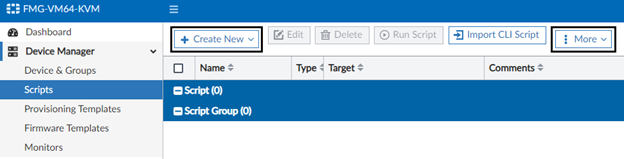

## Introduction: 

This project is provided (in FortiManger version 7.4) as a general guideline with configured objects needed to integrate with Netskope cloud services. One should consider understanding the requirements of the connectivity in terms of routing, Underlay and Overlay (IPsec) configurations and SDWAN rules for application steering. Three templates provided contain all the needed elements to integrate with said vendor but not limited to, as there may be additional configuration required due to unique circumstances for Firewall policies to allow traffic, Routing and Overlay (IPSec) configurations, along with SDWAN rules that will ultimately, steer HTTP and HTTPs traffic from FortiGate to Netskope services. 

## Requirements:

Since there are many dependencies and variables involved in order to configure SDWAN correctly, therefor, provided CLI templates are only functional when precise information is provided for the following:

This function requires: 

- FortiManager 7.4 or higher
- FortiOS 7.0 or higher
- Firewall Policy Configuration: Provide relevant information
    - From and to Interfaces, internal LAN to SDWAN Zones (Overlay)
    - Source and Destination IP addresses or blocks
    - Services allow or block per requirement
- Static Route(s): 
    - et device IP or FQDN and priority 
- IPsec Template: provided IPsec CLI is for reference only as specific configuration will be required for IPsec tunnels. 
    - Remote Device: IP address or Dynamic DNS
    -	Remote Gateway IP and subnet
    -	Phase 1 and 2 proposals for SA
    -	Pre-shared Key
    -	Tunnel interface IP
    -	Phase 2 configuration
-	SDWAN Template: Basic information is provided with generic data prefilled for SDWAN template to get started. However, user must configure and refine further with the following: 
    -	SDWAN Zones and member interfaces for underlay and overlay 
    -	Performance SLAs with preferred values
    -	SDWAN rules to steer web traffic to Netskope gateway 

## How to use the project: 

1.	Login to FortiManager (running 7.4)
2.	From the left navigational menu, click on Device Manager -> Scripts -> Import CLI Scripts

   

    

        

