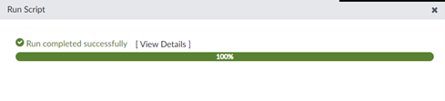

## Introduction: 

This project is provided (in FortiManger version 7.4) as a general guideline with configured objects needed to integrate with Skyhigh cloud services. One should consider understanding the requirements of the connectivity in terms of routing, Underlay and Overlay (IPsec) configurations and SDWAN rules for application steering. Three templates provided contain all the needed elements to integrate with said vendor but not limited to, as there may be additional configuration required due to unique circumstances for Firewall policies to allow traffic, Routing and Overlay (IPSec) configurations, along with SDWAN rules that will ultimately, steer HTTP and HTTPs traffic from FortiGate to Skyhigh services. 

## Requirements:

Since there are many dependencies and variables involved in order to configure SD-WAN correctly, therefor, provided CLI templates are only functional when precise information is provided for the following objects:

This function requires: 

- FortiManager 7.4 or higher
- FortiOS 7.0 or higher
- Firewall Policy Configuration: Provide relevant information
  - From and to Interfaces, internal LAN to SDWAN Zones (Overlay)
  -	Source and Destination IP addresses or blocks
  - Services allow or block per requirement
- Static Route(s): 
  - Set device IP or FQDN and priority 
- IPsec Template: provided IPsec CLI is for reference only as specific configuration will be required for IPsec tunnels. 
  - Remote Device: IP address or Dynamic DNS
  - Remote Gateway IP and subnet
  - Phase 1 and 2 proposals for SA
  - Pre-shared Key
  - Tunnel interface IP
  - Phase 2 configuration
- SDWAN Template: Basic information is provided with generic data prefilled for SDWAN template to get started. However, user must configure and refine further with the following: 
  - SDWAN Zones and member interfaces for underlay and overlay 
  - Performance SLAs with preferred values
  - SDWAN rules to steer web traffic to Skyhigh gateway 

## How to use the project: 

1.	Login to FortiManager running 7.4 
2.	From the left navigational menu, click on Device Manager -> Scripts -> Import CLI Scripts

3.	From the dialogue box, drag and drop CLI files or click on Add Files and then click on import. 

4.	Once the scripts are uploaded, user can run them one by one to the target devices (FortiGates). 

5.	Click OK to confirm running script. 

6.	You should see successful installation of the script on target device. 

7.	Repeat the process till all scripts are installed successfully, and then follow the required steps in the requirement section of this document, needed to fine tune the configuration per device for the final integration of FortiGate with Skyhigh Gateway. 

## Skyhigh Documentation: 

Skyhigh provides documentation around SSE SD-WAN integration with FortiGate where Skyhigh Security Service Edge allows for SD-WAN integrations with FortiGate. 
https://success.myshn.net/Start_Here_with_Skyhigh_Security/Security_Service_Edge_Integrations/SSE_SD-WAN_Integration

## Support:

Fortinet-provided scripts in this and other GitHub projects do not fall under the regular Fortinet technical support scope and are not supported by FortiCare Support Services. For direct issues, please refer to the Issues tab of this GitHub project. For other questions related to this project, contact github@fortinet.com.

## License:
License © Fortinet Technologies. All rights reserved.

